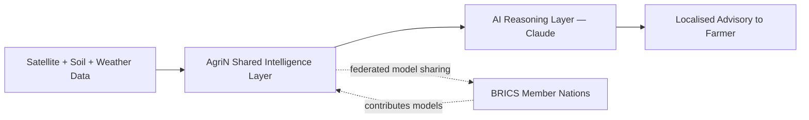

<div align="center">

# 🌾 AgriN
### Regenerative Agricultural Intelligence Network

**Track 4 — AgriN & Regenerative Agricultural Intelligence · BRICS Theme: Cooperation**
Built by **Team Sarcastic** for the CodeForCommunities Hackathon 2026

[](https://vanshitachoudhary.github.io/agrin/)


</div>

---

## 📖 Table of Contents

- [The Problem](#-the-problem)
- [Our Solution](#-our-solution)
- [Features](#-features)
- [Screenshots](#️-screenshots)
- [Architecture](#️-architecture)
- [Tech Stack](#-tech-stack)
- [Why This Approach](#-why-this-approach)
- [Getting Started](#-getting-started)
- [Project Structure](#-project-structure)
- [Roadmap](#️-roadmap)
- [BRICS Cooperation Impact](#-brics-cooperation-impact)
- [Team](#-team)
- [License](#-license)

---

## 🌍 The Problem

Small and marginal farmers across emerging economies lack access to data-driven agricultural guidance. Reliance on traditional methods — instead of satellite data, soil-health analytics, and climate forecasting — leads to preventable crop failure and threatens food security.

The absence of **shared digital infrastructure** also blocks cross-border collaboration on climate-resilient farming, even though BRICS nations face near-identical agronomic challenges: degrading soil health, erratic rainfall, and rising pest/disease pressure under a changing climate.

## 🌱 Our Solution

**AgriN** is an interoperable digital agriculture network — inspired by the BRICS AgriN initiative — that delivers real-time, localised agro-advisories using AI, and lets member nations share the *models* behind that intelligence without centralising raw farm data.

It's designed as a **scalable digital public good**: a thin, farmer-facing layer on top of a shared, federated intelligence backbone that any BRICS member can plug into.

## ✨ Features

### 📊 Live Regional Dashboard
- Composite land-health score, soil-health index, and satellite NDVI (vegetation health) per region
- 30-day NDVI trend chart and soil-composition breakdown
- Covers 5 founding regions: Malwa Plateau (India), Cerrado (Brazil), Free State (South Africa), Volga Basin (Russia), Heilongjiang (China)

### 🤖 AI Crop Advisor
- Farmer inputs soil type, season, rainfall band, and land-health priority (carbon rebuilding / water conservation / yield)
- A live AI agronomist reasons over the exact inputs and returns a tailored regenerative crop/rotation recommendation with justification
- Falls back to a rule-based recommendation engine if AI inference is unavailable — the feature never breaks

### 🔬 Disease Scanner
- Upload a leaf photo for instant diagnosis: likely issue, confidence score, and treatment steps
- Backed by AI vision analysis where available, with an on-device colour/texture heuristic as an offline-friendly fallback
- Built for low-connectivity rural deployment from day one

### 🌐 BRICS Network View
- Visual model of the shared-intelligence layer connecting 5 member nations
- Live stats on models shared, cross-border disease alerts propagated, and connected farms

## 🖼️ Screenshots

> Open the [live demo](https://vanshitachoudhary.github.io/agrin/) and add screenshots of each of the 4 views here before submission — Dashboard, Crop Advisor, Disease Scanner, and BRICS Network.

| Dashboard | Crop Advisor | Disease Scanner | BRICS Network |
|---|---|---|---|
| _add screenshot_ | _add screenshot_ | _add screenshot_ | _add screenshot_ |

## 🏗️ Architecture



The prototype runs the dashboard on representative regional data with a live AI reasoning layer already wired into the Crop Advisor and Disease Scanner. The production roadmap swaps this for real Sentinel-2 / MODIS satellite feeds and national soil-health datasets, ingested through the same shared layer — so the farmer-facing experience doesn't change as the backend matures.

## 🧰 Tech Stack

| Layer | Choice |
|---|---|
| Frontend | Single-page responsive web app — HTML5, CSS3, vanilla JavaScript |
| Charts & data viz | Chart.js |
| AI layer | Claude — crop-advisory reasoning + leaf-image diagnosis |
| Planned backend | FastAPI + PostgreSQL |
| Planned data sources | Sentinel-2 / MODIS satellite feeds, national soil-health datasets |
| Planned cooperation layer | Federated model-sharing protocol for BRICS partners |
| Companion build | Python + Streamlit + Plotly ([`streamlit-app/`](streamlit-app/)) — same modules, alternate stack |

## 🎯 Why This Approach

- **Federated, not centralised** — each nation keeps its own farm data local and shares only trained models, respecting data sovereignty while compounding shared intelligence across borders.
- **Offline-first by design** — the diagnostic flow degrades gracefully to an on-device heuristic when connectivity or inference isn't available, which matters for low-connectivity rural regions.
- **Built to scale as a digital public good** — the dashboard, advisor, and scanner are thin clients over a shared data/model layer, not siloed one-off features.
- **Resilient UX** — every AI-powered feature has a deterministic fallback, so the product never shows a dead end to a farmer in the field.

## 🚀 Getting Started

This is a single self-contained HTML file — no build step, no dependencies to install.

```bash
git clone https://github.com/<your-username>/agrin.git
cd agrin
open index.html   # or just double-click the file
```

Recommended — serve it locally so all features behave exactly as in production:

```bash
python3 -m http.server 8000
# then visit http://localhost:8000
```

This repo is also live via GitHub Pages: **https://vanshitachoudhary.github.io/agrin/**

## 📁 Project Structure
